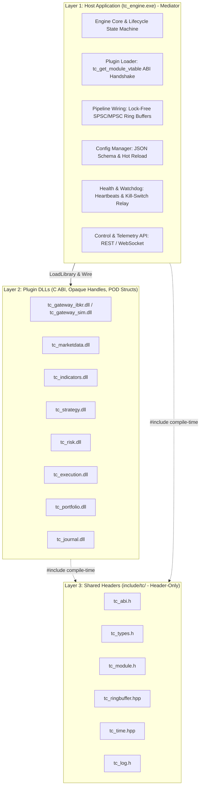
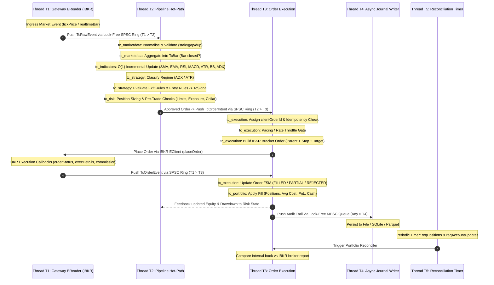
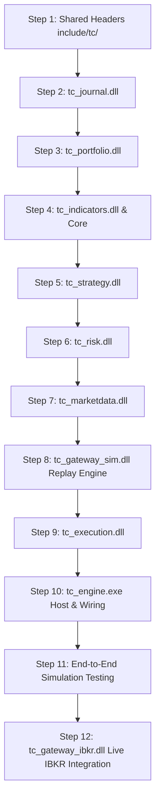
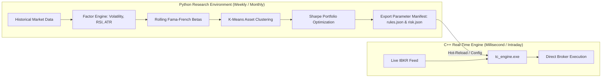

# Complete Trading System Development Roadmap & Step-by-Step Implementation Guide
**Based on Architecture & Workflow Specification: `trading_system_workflow.drawio`**

---

## Executive Summary & System Overview

This document provides an exhaustive, end-to-end technical guide for engineering the **Production Rule-Based Algorithmic Trading System** specified in [`trading_system_workflow.drawio`](file:///Users/yash/Documents/Projects/others/quant_developer_learning/trading_system_workflow.drawio). 

The target system is a high-performance, modular C++ trading platform operating under a **strict C ABI plugin dynamic link library (DLL) architecture**, integrated with **Interactive Brokers (IBKR TWS / IB Gateway)** for live market execution, complemented by a zero-allocation, lock-free 5-thread pipeline runtime model.



---

## 1. What Has Been Completed Already

The repository currently contains the analytical foundations, financial mathematics solvers, and the Python quantitative research pipeline that inform strategy design:

### 1.1 C++ High-Performance Mathematical & Econometric Libraries ([`functions/`](file:///Users/yash/Documents/Projects/others/quant_developer_learning/Algorithmic%20Trading%20Machine%20Learning%20Strategies/functions))
Five standalone DLL modules have been compiled and verified with MinGW GCC on Windows:
1. **[`MathLib.dll`](file:///Users/yash/Documents/Projects/others/quant_developer_learning/Algorithmic%20Trading%20Machine%20Learning%20Strategies/functions/include/MathLib.h):** Arithmetic fundamentals and present value calculation for geometric annuities with growth and discount rate handling.
2. **[`calculateYTMYield.dll`](file:///Users/yash/Documents/Projects/others/quant_developer_learning/Algorithmic%20Trading%20Machine%20Learning%20Strategies/functions/include/calculateYTMYield.h):** Analytical coupon bond pricing and high-precision **Newton-Raphson** numerical solver for Yield to Maturity (YTM) supporting annual, semi-annual, and quarterly coupon frequencies.
3. **[`calculateZeroCouponYield.dll`](file:///Users/yash/Documents/Projects/others/quant_developer_learning/Algorithmic%20Trading%20Machine%20Learning%20Strategies/functions/include/calculateZeroCouponYield.h):** Spot yield solvers for zero-coupon instruments with annual compounding ($y = (F/P)^{1/T} - 1$) and continuous compounding ($y_{\text{cont}} = \ln(F/P)/T$).
4. **[`calculateADF.dll`](file:///Users/yash/Documents/Projects/others/quant_developer_learning/Algorithmic%20Trading%20Machine%20Learning%20Strategies/functions/include/calculateADF.h):** Augmented Dickey-Fuller (ADF) unit-root stationarity test using Ordinary Least Squares (OLS) regression with MacKinnon asymptotic critical values (1%, 5%, 10%).
5. **[`calculateCointegration.dll`](file:///Users/yash/Documents/Projects/others/quant_developer_learning/Algorithmic%20Trading%20Machine%20Learning%20Strategies/functions/include/calculateCointegration.h):** Engle-Granger two-step cointegration engine for statistical arbitrage pairs trading, outputting hedge ratio $\beta$, intercept $\alpha$, $R^2$, and residual spread unit-root test statistic against Engle-Yoo critical values.
6. **Integration Driver & Build Harness:** [`main.cpp`](file:///Users/yash/Documents/Projects/others/quant_developer_learning/Algorithmic%20Trading%20Machine%20Learning%20Strategies/functions/main.cpp), [`build.bat`](file:///Users/yash/Documents/Projects/others/quant_developer_learning/Algorithmic%20Trading%20Machine%20Learning%20Strategies/functions/build.bat), and [`Makefile`](file:///Users/yash/Documents/Projects/others/quant_developer_learning/Algorithmic%20Trading%20Machine%20Learning%20Strategies/functions/Makefile) automating multi-DLL linking and functional verification.

### 1.2 Python Machine Learning & Factor Research Pipeline
* **[`Algorithmic_Trading_Machine_Learning_Quant_Strategies.ipynb`](file:///Users/yash/Documents/Projects/others/quant_developer_learning/Algorithmic%20Trading%20Machine%20Learning%20Strategies/Algorithmic_Trading_Machine_Learning_Quant_Strategies.ipynb):**
  - S&P 500 multi-asset automated historical data pipeline.
  - Technical indicator computation: Garman-Klass Volatility, RSI, Bollinger Bands, ATR, MACD, Dollar Volume.
  - Rolling Fama-French 5-factor regression analysis via `statsmodels.regression.rolling.RollingOLS`.
  - Monthly cross-sectional K-Means clustering of assets based on risk and momentum factors.
  - Maximum Sharpe ratio portfolio optimization via `PyPortfolioOpt` and Markowitz Efficient Frontier generation.
* **Datasets:** Real and simulated pricing and sentiment data ([`simulated_5min_data.csv`](file:///Users/yash/Documents/Projects/others/quant_developer_learning/Algorithmic%20Trading%20Machine%20Learning%20Strategies/simulated_5min_data.csv), [`simulated_daily_data.csv`](file:///Users/yash/Documents/Projects/others/quant_developer_learning/Algorithmic%20Trading%20Machine%20Learning%20Strategies/simulated_daily_data.csv), [`sentiment_data.csv`](file:///Users/yash/Documents/Projects/others/quant_developer_learning/Algorithmic%20Trading%20Machine%20Learning%20Strategies/sentiment_data.csv)).

### 1.3 Learning Syllabus & Roadmap Tracking
* **[`Quant Developer Roadmap - 12 Week Plan.pdf`](file:///Users/yash/Documents/Projects/others/quant_developer_learning/Quant%20Developer%20Roadmap%20-%2012%20Week%20Plan.pdf)** and **[`quant_developer_roadmap_tracker.html`](file:///Users/yash/Documents/Projects/others/quant_developer_learning/quant_developer_roadmap_tracker.html)** establishing the 12-week progression from statistical modeling to production C++ low-latency engineering.

---

## 2. What Is Next (Gap Analysis & Immediate Priorities)

The mathematical DLLs and Python scripts currently exist as isolated research components. **The full production system defined in [`trading_system_workflow.drawio`](file:///Users/yash/Documents/Projects/others/quant_developer_learning/trading_system_workflow.drawio) must now be constructed.**

### Core Architectural Gaps to Build:
1. **Shared C ABI Header Layer (`include/tc/`):** Define the binary boundary standards, versioned Plain Old Data (POD) structs, opaque handles, fixed-point price representation, and error codes.
2. **Lock-Free Concurrency Primitives:** Implement cache-line aligned (`alignas(64)`), zero-allocation Single-Producer Single-Consumer (SPSC) and Multi-Producer Single-Consumer (MPSC) ring buffers.
3. **The 8 Plugin DLL Modules:**
   - `tc_journal.dll` (audit logging & asynchronous disk writer).
   - `tc_portfolio.dll` (position tracking, real-time PnL, cash ledger, and IBKR reconciliation).
   - `tc_indicators.dll` (header-only $O(1)$ ring buffer core + shared dynamic library).
   - `tc_strategy.dll` (regime classifier, rule engine, signal generator).
   - `tc_risk.dll` (position sizing, pre-trade checks, and atomic kill switch).
   - `tc_marketdata.dll` (tick normalizer, validator, bar aggregator, session calendar).
   - `tc_gateway_sim.dll` (historical bar/tick replay harness for deterministic backtesting).
   - `tc_execution.dll` (order management FSM, pacing throttle, bracket order generator).
   - `tc_gateway_ibkr.dll` (Interactive Brokers TWS API C++ client integration).
4. **Host Application (`tc_engine.exe`):**
   - Dynamic plugin loader (`LoadLibrary`/`GetProcAddress` on Windows, `dlopen`/`dlsym` on POSIX).
   - 5-thread runtime architecture (T0 Orchestrator, T1 Gateway Ingress, T2 Hot Pipeline, T3 Order Execution, T4 Async Journal, T5 Reconciliation Timer).
   - JSON configuration manager with hot-reload capabilities.
   - Telemetry API (REST / WebSocket) and health watchdog.

---

## 3. System Architecture & Design Principles (From Diagram 1 & 4)

### 3.1 Strict C ABI Boundary Rules
To ensure rock-solid stability, hot-swappability, and eliminate binary incompatibilities:
1. **Single Mandatory Export per DLL:** Every plugin exports exactly one symbol:
   ```c
   TC_API const TcModuleVTable* tc_get_module_vtable(void);
   ```
2. **Zero C++ ABI Leaks:** No C++ classes, `std::string`, `std::vector`, exceptions, or RTTI are permitted to cross any DLL boundary. All interfaces use `extern "C"`, opaque handles (`TcHandle`), and POD structs.
3. **Struct Versioning & Backward Compatibility:** Every struct begins with `uint32_t struct_size` and `uint16_t version`. Any new fields are strictly append-only.
4. **Symmetric Memory Ownership:** Each DLL must allocate and deallocate its own memory via explicit `create` / `destroy` pairs. Memory is never freed across a module boundary.
5. **Mediator Pattern (No Cross-DLL Linking):** Plugin DLLs never link to or call each other directly. The host application (`tc_engine.exe`) acts as the mediator, wiring modules together via function pointers and ring buffers.
6. **ABI Handshake:** At load time, `tc_engine.exe` validates `TC_ABI_VERSION = 0x00010000`. If a mismatch is detected, the engine aborts during startup.
7. **Error Codes Instead of Exceptions:** All exported functions return `TcStatus`. Internal C++ exceptions must be trapped with `try/catch` at the DLL boundary.

### 3.2 Performance & Low-Latency Principles
1. **Zero-Allocation Hot Path:** No heap allocation (`malloc`, `new`) occurs during the trading loop. All queues, ring buffers, and object pools are pre-allocated at startup.
2. **Direct Function Table Calls on Hot Path (T2):** Market Data $\to$ Indicators $\to$ Strategy $\to$ Risk executes sequentially on a single thread (T2) using direct function-pointer calls without queue hops, lock contention, or data copying.
3. **Fixed-Point Price Representation:** All prices are represented as fixed-point 64-bit integers (`typedef int64_t TcPrice`), scaled by $10^4$ (4 decimal places), eliminating floating-point non-determinism.
4. **False Sharing Prevention:** Ring buffer indices and atomic flags are aligned to 64-byte cache lines (`alignas(64)`).
5. **Decoupled I/O:** Disk persistence and database logging are offloaded to an asynchronous writer thread (T4).

---

## 4. Runtime Threading & Execution Workflow (From Diagram 2)



### Thread Responsibilities:
* **T0 (Host Engine / Orchestrator):** Lifecycle state machine, dynamic DLL loader, JSON config parser, REST/WebSocket control API, watchdog monitor.
* **T1 (Gateway Ingress Thread):** Dedicated IBKR `EReader` socket thread. Reads incoming wire frames and dispatches raw market events to $T1 \to T2$ ring buffer and broker order callbacks to $T1 \to T3$ ring buffer.
* **T2 (Pipeline Hot-Path Thread):** Sequential, zero-lock processing: Normalizer $\to$ Bar Aggregator $\to$ Incremental Indicators $\to$ Strategy Rules $\to$ Risk Sizing. Emits `TcOrderIntent` to $T2 \to T3$ ring buffer.
* **T3 (Execution & Order Thread):** Consumes `TcOrderIntent`, manages order state machines (`NEW`, `SENT`, `ACK`, `PARTIAL`, `FILLED`, `CANCELLED`), throttles pacing to prevent IBKR rate violations (50 msgs/sec), constructs bracket orders, applies fills to `tc_portfolio`, and feeds updated equity/exposure back to `tc_risk`.
* **T4 (Journal Async Writer Thread):** Consumes structured event records from a multi-producer lock-free queue and flushes them to rotating files, SQLite, or Apache Parquet without blocking the execution path.
* **T5 (Timer & Reconciliation Thread):** Background heartbeat timer, periodic account and position reconciliation against IBKR, and end-of-day snapshot emitter.

---

## 5. Lifecycle, State Machine & Fault Handling (From Diagram 3)

### 5.1 Engine State Machine
$$\text{INIT} \longrightarrow \text{CONNECTING} \longrightarrow \text{SYNCING} \longrightarrow \text{RUNNING} \underset{\text{Recover}}{\overset{\text{Fault}}{\rightleftarrows}} \text{DEGRADED} \longrightarrow \text{HALTED} \longrightarrow \text{STOPPING} \longrightarrow \text{STOPPED}$$

### 5.2 Deterministic Startup Sequence
1. **Config Validation:** Load and validate `engine.json`, `rules.json`, and `risk.json` against strict schemas.
2. **Journal Initialization:** Load `tc_journal.dll` first so every subsequent initialization step is logged.
3. **DLL Loading & ABI Handshake:** Load each DLL via `LoadLibrary`, resolve `tc_get_module_vtable()`, and verify `abi_version == TC_ABI_VERSION`.
4. **Dependency-Ordered Instantiation:**
   $$\text{tc\_portfolio} \to \text{tc\_risk} \to \text{tc\_indicators} \to \text{tc\_strategy} \to \text{tc\_execution} \to \text{tc\_marketdata} \to \text{tc\_gateway}$$
   Wire function table sinks and pre-allocate ring buffers.
5. **Gateway Connection:** Connect to IB Gateway / TWS (`EClient::eConnect`) with exponential backoff.
6. **State Synchronization:** Request open orders (`reqOpenOrders`), positions (`reqPositions`), and account updates (`reqAccountUpdates`). Reconcile internal book.
7. **Indicator Warm-up:** Request historical bars (`reqHistoricalData`) to prime indicator rings and establish trend/volatility regimes.
8. **Launch Threads (T1–T5):** Arm the atomic kill switch to `OFF` and transition state to `RUNNING`.

### 5.3 Graceful Shutdown Sequence
1. Set halt flag to disallow new order intents; drain in-flight signals.
2. Apply shutdown policy: Cancel working entry orders; keep protective stops active at the broker.
3. Flush ring buffers and process remaining pending fill reports.
4. Perform final reconciliation vs IBKR; persist state snapshot and end-of-day journal report.
5. Disconnect gateway (`eDisconnect`); signal threads T1–T5 to stop and join.
6. Destroy modules in reverse dependency order and call `FreeLibrary`. Exit cleanly with code 0.

### 5.4 Fault Classification & Recovery
| Fault Event | Detection Source | Engine State Transition | Automated Action |
| :--- | :--- | :--- | :--- |
| **IBKR Disconnect (Code 1100/1101/1102)** | Gateway EWrapper | $\to$ `DEGRADED` | Block new entries; maintain protective broker stops; initiate exponential backoff reconnect; resubscribe & backfill upon reconnect. |
| **Feed Stale (> $N$ seconds)** | Market Data Watchdog | $\to$ `DEGRADED` | Invalidate price feeds; mark feed degraded; trigger historical bar backfill. |
| **Order Timeout / Reject** | Execution Module | `RUNNING` (Exception Handler) | Resync via `reqOpenOrders`; log error code; if repeated $N$ times, escalate to `HALTED`. |
| **Position / Cash Mismatch** | Portfolio Reconciler (T5) | Symbol $\to$ `HALT` | Engage per-symbol kill switch; cancel working orders for that symbol; alert operator; resync from broker. |
| **Risk Limit Breach** | Risk Module (T2/T3) | $\to$ `HALTED` | Daily loss / drawdown / exposure breached: engage global atomic kill switch; reject new orders. |
| **Module Internal Error (`TC_ERR_INTERNAL`)** | Any Module | $\to$ `HALTED` | Immediate halt; alert operator; manual operator acknowledge required to restart. |

---

## 6. Target Project Layout & Repository Structure

```text
quant_developer_learning/
├── trading_system_workflow.drawio              # Master visual architecture specification
├── TRADING_SYSTEM_DEVELOPMENT_GUIDE.md         # This comprehensive implementation guide
├── tc-trader/                                  # Production C++ Trading System
│   ├── CMakeLists.txt                          # Master CMake configuration
│   ├── config/                                 # Configuration files
│   │   ├── engine.json                         # Network, broker, thread, and symbol config
│   │   ├── rules.json                          # Rule-based entry/exit parameter definitions
│   │   └── risk.json                           # Position sizing limits and drawdown thresholds
│   ├── include/                                # Header-only shared interface layer (Layer 3)
│   │   └── tc/
│   │       ├── tc_abi.h                        # TC_API export macros, status codes, opaque handles
│   │       ├── tc_types.h                      # Versioned POD structs (TcBar, TcTick, TcSignal, etc.)
│   │       ├── tc_module.h                     # Module VTable interface definitions
│   │       ├── tc_ringbuffer.hpp               # Lock-free SPSC and MPSC ring buffer templates
│   │       ├── tc_time.hpp                     # Monotonic nanosecond clock & calendar helpers
│   │       ├── tc_log.h                        # Non-blocking logging macros
│   │       ├── gateway/tc_gateway.h            # ITcGateway interface
│   │       ├── marketdata/tc_marketdata.h      # ITcMarketData interface
│   │       ├── indicators/tc_indicators.h      # ITcIndicators interface
│   │       ├── indicators/tc_indicators_core.hpp # Inlined O(1) math core
│   │       ├── strategy/tc_strategy.h          # ITcStrategy interface
│   │       ├── risk/tc_risk.h                  # ITcRisk interface
│   │       ├── execution/tc_execution.h        # ITcExecution interface
│   │       ├── portfolio/tc_portfolio.h        # ITcPortfolio interface
│   │       └── journal/tc_journal.h            # ITcJournal interface
│   ├── modules/                                # Plugin DLL source directories (Layer 2)
│   │   ├── gateway_ibkr/                       # Live IBKR TWS API C++ client wrapper
│   │   ├── gateway_sim/                        # Fast deterministic CSV/Parquet historical replay
│   │   ├── marketdata/                         # Normalizer, validator, and bar aggregator
│   │   ├── indicators/                         # Standalone indicator DLL
│   │   ├── strategy/                           # Rule evaluator, regime classifier, signal combiner
│   │   ├── risk/                               # Position sizer, pre-trade checks, kill switch
│   │   ├── execution/                          # Order FSM, pacing throttle, bracket builder
│   │   ├── portfolio/                          # Position book, PnL calculator, broker reconciler
│   │   └── journal/                            # MPSC queue, async file writer, SQLite/Parquet sink
│   ├── engine/                                 # Host application (Layer 1)
│   │   ├── CMakeLists.txt
│   │   ├── main.cpp                            # Host application entry point (tc_engine.exe)
│   │   ├── loader.hpp / loader.cpp             # Dynamic library loader and ABI validator
│   │   ├── pipeline.hpp / pipeline.cpp         # SPSC ring wiring and thread creation (T0–T5)
│   │   ├── config_manager.hpp                  # JSON config parser with hot reload
│   │   └── watchdog.hpp                        # Heartbeat, feed staleness, and fault supervisor
│   └── tests/                                  # Unit tests, integration tests, and replay harness
│       ├── test_ringbuffer.cpp
│       ├── test_indicators.cpp
│       ├── test_strategy.cpp
│       ├── test_risk.cpp
│       ├── test_portfolio.cpp
│       └── replay_harness.cpp                  # End-to-end deterministic backtest runner
└── Algorithmic Trading Machine Learning Strategies/ # Existing research & mathematical libraries
    ├── functions/                              # MathLib, calculateYTMYield, calculateADF, etc.
    └── Algorithmic_Trading_Machine_Learning_Quant_Strategies.ipynb # Python ML models
```

---

## 7. Step-by-Step Implementation Guide

Follow this 12-step sequential engineering roadmap. Each phase yields an independently testable component before proceeding to the next.



### Step 1: Shared Headers & Core Concurrency (`include/tc/`)
* **Objective:** Establish the foundational types, ABI contracts, and zero-allocation lock-free ring buffers.
* **Files to create:**
  - `include/tc/tc_abi.h`: Define `TC_API_VERSION 0x00010000`, `TC_API` export macros, `TcStatus` enum, opaque handle typedef `TcHandle`, and fixed-point `TcPrice` (`int64_t`).
  - `include/tc/tc_types.h`: Define POD structs (`TcTick`, `TcBar`, `TcIndicatorSnapshot`, `TcSignal`, `TcOrderIntent`, `TcOrderEvent`, `TcFill`, `TcPosition`, `TcAccountView`). Each struct must include `uint32_t struct_size` and `uint16_t version`.
  - `include/tc/tc_module.h`: Define `TcModuleVTable` struct containing function pointers (`create`, `start`, `stop`, `destroy`, `get_status`, `get_interface`) and declare `tc_get_module_vtable`.
  - `include/tc/tc_ringbuffer.hpp`: Implement high-performance lock-free ring buffers:
    - `TcRingBufferSPSC<T, Capacity>`: Single-Producer Single-Consumer queue using cache-line padded atomic head and tail pointers (`alignas(64) std::atomic<size_t>`).
    - `TcQueueMPSC<T, Capacity>`: Multi-Producer Single-Consumer queue for logging.
  - `include/tc/tc_time.hpp`: High-resolution monotonic clock returning `int64_t` nanoseconds (`std::chrono::steady_clock`), and market session calendar utilities.
  - `include/tc/tc_log.h`: Lightweight macros (`TC_LOG_INFO`, `TC_LOG_WARN`, `TC_LOG_ERROR`) routing into `tc_journal`.
* **Verification:** Write `tests/test_ringbuffer.cpp` to verify zero data loss across $10^7$ iterations under multi-threaded contention.

---

### Step 2: Logging & Audit Module (`tc_journal.dll`)
* **Objective:** Implement the asynchronous logging and audit trail infrastructure.
* **Header:** `include/tc/journal/tc_journal.h` (`ITcJournal`).
* **Implementation Details:**
  - Internal lock-free MPSC queue receiving log events from all engine threads without blocking.
  - Dedicated Thread T4 (`AsyncWriter`) polling the MPSC queue and writing to disk.
  - Rotating file sink: Writes structured text or binary logs with automatic rollover based on size or daily session boundary.
  - SQLite sink: Persists order states, fills, and reconciliation reports into an indexed local database for historical queries.
* **Exported Interface:**
  - `log(TcLogLevel level, int32_t code, const TcEvent* event)`
  - `snapshot(const void* state_blob, size_t size)`
  - `flush()`
* **Verification:** Verify that thread T2 can enqueue $10^6$ messages in $<15\text{ ms}$ while T4 writes concurrently without blocking the producer.

---

### Step 3: Portfolio & Accounting Module (`tc_portfolio.dll`)
* **Objective:** Maintain real-time internal books, calculate PnL, track cash, and reconcile against broker statements.
* **Header:** `include/tc/portfolio/tc_portfolio.h` (`ITcPortfolio`).
* **Implementation Details:**
  - `PositionBook`: Tracks current inventory per `symbol_id`, total volume, and weighted average entry price.
  - `PnLEngine`: Computes realized PnL on position reductions/closures and marks open positions to market to compute unrealized PnL.
  - `CashLedger`: Tracks cash balance, reserved margin, and accumulated commissions.
  - `Reconciler`: Compares internal positions and cash balance against broker snapshots received via IBKR `reqPositions` and `reqAccountUpdates`. Discrepancies generate discrepancy flags and trigger symbol-level halts.
* **Exported Interface:**
  - `apply_fill(const TcFill* fill)`
  - `get_position(int32_t symbol_id, TcPosition* out)`
  - `get_account(TcAccountView* out)`
  - `reconcile(const TcBrokerPosition* broker_positions, size_t count, TcReconcileReport* report)`
* **Verification:** Unit test with synthetic fills; verify exact realized PnL, average price adjustments, and reconciliation mismatch detection.

---

### Step 4: Incremental Technical Indicators (`tc_indicators.dll` & Core)
* **Objective:** Compute technical indicators incrementally in $O(1)$ time with zero dynamic memory allocation.
* **Headers:** `include/tc/indicators/tc_indicators.h` and `include/tc/indicators/tc_indicators_core.hpp`.
* **Implementation Details:**
  - Provide a header-only core (`tc_indicators_core.hpp`) using fixed-size circular arrays so calculations can be directly inlined into `tc_strategy.dll` on the hot path.
  - Indicators implemented:
    - **SMA / EMA:** Moving averages with incremental ring updating.
    - **RSI (14):** Wilder's smoothed average gain/loss.
    - **MACD (12, 26, 9):** Fast/Slow EMA difference and signal line.
    - **ATR (14):** Average True Range using high/low/close rings.
    - **Bollinger Bands (20, 2.0):** Moving average and running variance.
    - **ADX (14):** Average Directional Index with directional movement ($+DM$, $-DM$) rings.
  - Maintains `warmup_bars_required` counter per symbol; populates `valid_mask` inside `TcIndicatorSnapshot` only once warm-up is complete.
* **Exported Interface:**
  - `create_set(const TcIndicatorSpec* spec, TcHandle* out)`
  - `update_bar(TcHandle handle, const TcBar* bar)`
  - `get_snapshot(TcHandle handle, int32_t symbol_id, TcIndicatorSnapshot* out)`
  - `reset(TcHandle handle)`
* **Verification:** Compare indicator output values against `pandas_ta` results from the Python research notebook across 10,000 bars; maximum deviation must not exceed $10^{-6}$.

---

### Step 5: Rule-Based Strategy Module (`tc_strategy.dll`)
* **Objective:** Implement deterministic market regime classification and rule evaluation to generate trade signals.
* **Header:** `include/tc/strategy/tc_strategy.h` (`ITcStrategy`).
* **Implementation Details:**
  - **Pure Function Architecture:** Evaluates `(TcIndicatorSnapshot, TcPositionView) -> TcSignal[]`. Contains zero I/O and zero broker calls.
  - **RegimeClassifier:** Classifies market context into `TRENDING`, `RANGING`, or `HIGH_VOLATILITY` using ADX threshold ($>25$) and ATR percentile.
  - **ExitRules Evaluator:** Checks open positions against:
    - ATR Trailing Stop.
    - Fixed Take-Profit Target.
    - Moving Average / MACD Reversal Signal.
    - Max Holding Time Stop (intraday timeout).
  - **EntryRules Evaluator:** If regime permits new entries:
    - Trend following: Fast/Slow MA crossover + RSI confirmation.
    - Mean reversion: Bollinger Band boundary rejection + RSI oversold/overbought.
  - **RuleSet Config:** Loads rule definitions and thresholds dynamically from `rules.json` with hot-reload support.
* **Exported Interface:**
  - `configure(const char* rules_json)`
  - `on_snapshot(const TcIndicatorSnapshot* snapshot, const TcPositionView* position, TcSignal* signals_out, size_t max_signals, size_t* num_signals)`
* **Verification:** Unit test with synthetic indicator snapshots representing sharp trends, range-bound chop, and extreme volatility.

---

### Step 6: Risk Management & Sizing (`tc_risk.dll`)
* **Objective:** Enforce capital protection, calculate position sizes, perform pre-trade checks, and provide an atomic kill switch.
* **Header:** `include/tc/risk/tc_risk.h` (`ITcRisk`).
* **Implementation Details:**
  - **PositionSizer:** Fixed-fractional risk model sizing orders such that dollar loss at stop price equals a configured percentage (e.g., $1.0\%$) of portfolio equity:
    $$\text{Quantity} = \frac{\text{Equity} \times \text{RiskPct}}{|\text{EntryPrice} - \text{StopPrice}|}$$
  - **PreTradeChecks:**
    - Maximum single position size ($<\text{MaxPosSize}$).
    - Gross and net portfolio exposure limits.
    - Maximum leverage and minimum available buying power.
    - Price collar validation (reject orders if price is outside allowable tolerance of last known market price).
  - **KillSwitch:** Global and per-symbol atomic flag (`std::atomic<bool>`). If daily drawdown or portfolio loss exceeds configured limits, the kill switch is engaged, blocking all new order intents.
* **Exported Interface:**
  - `evaluate_signal(const TcSignal* signal, const TcAccountView* account, TcOrderIntent* intent_out, TcRiskDecision* decision)`
  - `update_state(const TcAccountView* account)`
  - `set_kill_switch(int32_t symbol_id, bool active)`
  - `get_kill_switch(int32_t symbol_id, bool* active)`
* **Verification:** Test boundary conditions: oversized orders, zero stop-distance, margin exhaustion, and simulated $5\%$ drawdown triggering immediate kill-switch lock.

---

### Step 7: Market Data Module (`tc_marketdata.dll`)
* **Objective:** Ingest raw market feed callbacks, validate data integrity, aggregate ticks into bars, and monitor feed health.
* **Header:** `include/tc/marketdata/tc_marketdata.h` (`ITcMarketData`).
* **Implementation Details:**
  - **TickNormalizer:** Converts raw gateway ticks into fixed-point `TcTick` and `TcBar` POD structures with nanosecond timestamps.
  - **DataValidator:** Discards invalid data:
    - Stale ticks (timestamp older than current bar).
    - Timestamp inversions and duplicate ticks.
    - Outlier prices exceeding statistical variance bands.
    - Gaps in continuous bar series.
  - **BarAggregator:** Aggregates valid ticks into standard time bars (e.g., 5-minute bars) adhering to market session calendar opening/closing boundaries.
  - **FeedHealthMonitor:** Tracks tick arrival intervals; if no tick arrives within $N$ seconds during market hours, feed status is transitioned to `DEGRADED`, and a backfill request is queued.
* **Exported Interface:**
  - `on_raw_event(const TcRawEvent* raw_event)`
  - `set_bar_sink(TcBarCallback sink, void* user_data)`
  - `get_feed_status(int32_t symbol_id, TcFeedStatus* status)`
  - `reset_symbol(int32_t symbol_id)`
* **Verification:** Feed synthetic ticks with artificial noise, duplicates, and out-of-order timestamps; verify that the output bar sequence is strictly monotonic, valid, and clean.

---

### Step 8: Historical Simulation Gateway (`tc_gateway_sim.dll`)
* **Objective:** Provide a fast, deterministic market replay engine sharing the identical C ABI with the live IBKR gateway for reproducible backtesting.
* **Header:** `include/tc/gateway/tc_gateway.h` (`ITcGateway`).
* **Implementation Details:**
  - Parses historical CSV and Parquet files ([`simulated_5min_data.csv`](file:///Users/yash/Documents/Projects/others/quant_developer_learning/Algorithmic%20Trading%20Machine%20Learning%20Strategies/simulated_5min_data.csv), [`simulated_daily_data.csv`](file:///Users/yash/Documents/Projects/others/quant_developer_learning/Algorithmic%20Trading%20Machine%20Learning%20Strategies/simulated_daily_data.csv)).
  - Simulates the gateway callback interface on thread T1, pumping historical bars into the $T1 \to T2$ ring buffer.
  - Simulates an exchange matching engine on thread T3: evaluates incoming limit and stop orders against high/low prices of subsequent bars, simulating realistic execution slippage and commissions.
* **Exported Interface (Identical to `tc_gateway_ibkr.dll`):**
  - `connect(const TcGatewayConfig* config)`
  - `subscribe_bars(int32_t symbol_id, uint16_t timeframe)`
  - `place_order(const TcOrder* order, uint64_t* client_order_id)`
  - `cancel_order(uint64_t client_order_id)`
  - `set_event_sink(TcGatewayCallback sink, void* user_data)`
* **Verification:** Replay a 1-year 5-minute dataset; verify that total fills, equity curves, and trade counts match theoretical expectations down to the cent.

---

### Step 9: Execution & Order Management (`tc_execution.dll`)
* **Objective:** Manage order lifecycles, construct bracket orders, throttle submission rates, and handle execution exceptions.
* **Header:** `include/tc/execution/tc_execution.h` (`ITcExecution`).
* **Implementation Details:**
  - **OrderManager:** Assigns unique, sequential `client_order_id` values and tracks order states in an explicit Finite State Machine (FSM):
    $$\text{NEW} \longrightarrow \text{SENT} \longrightarrow \text{ACK} \longrightarrow \begin{cases} \text{PARTIAL} \longrightarrow \text{FILLED} \\ \text{CANCELLED} \\ \text{REJECTED} \end{cases}$$
  - **BracketBuilder:** Converts a `TcOrderIntent` into an IBKR bracket order structure: a primary parent entry order (market or limit) linked with a protective stop-loss child order and a profit-taking limit child order using IBKR `parentId` and OCA (One-Cancels-All) groups.
  - **PacingLimiter:** Queues and throttles order requests to strictly comply with IBKR API pacing rules (maximum 50 messages/second).
  - **Exception & FillHandler:**
    - `PARTIAL`: Updates filled quantity, leaves remaining quantity working until fill or timeout.
    - `REJECTED`: Logs reason code and alerts operator.
    - `TIMEOUT`: Issues `reqOpenOrders` to resynchronize state with the broker before retrying.
* **Exported Interface:**
  - `submit_intent(const TcOrderIntent* intent)`
  - `on_gateway_event(const TcOrderEvent* event)`
  - `cancel_order(uint64_t client_order_id)`
  - `cancel_all()`
  - `set_fill_sink(TcFillCallback sink, void* user_data)`
* **Verification:** Simulate gateway disconnects, broker order rejections, and partial fills; verify that order state transitions remain consistent and never orphan protective stop orders.

---

### Step 10: Host Application Engine (`tc_engine.exe`)
* **Objective:** Serve as the central mediator, load plugins, wire lock-free ring buffers, spawn threads T0–T5, and manage system lifecycle.
* **Source:** `engine/main.cpp`, `engine/loader.cpp`, `engine/pipeline.cpp`, `engine/config_manager.cpp`.
* **Implementation Details:**
  - **Plugin Loader:** Loads DLLs dynamically via `LoadLibrary` (`GetProcAddress`), validates `TC_ABI_VERSION`, and caches module VTables.
  - **Pipeline Wiring:** Allocates and wires lock-free SPSC rings:
    - $T1 \to T2$: Raw gateway events $\to$ Market Data.
    - $T2 \to T3$: Approved `TcOrderIntent` $\to$ Execution Order Manager.
    - $T1 \to T3$: Gateway broker events $\to$ Execution Order Manager.
    - Any $\to T4$: Lock-free MPSC queue $\to$ Journal writer.
  - **Thread Spawner:** Creates and manages the 5 pipeline threads (T1 to T5), assigning thread affinities and priorities where supported.
  - **Lifecycle Orchestrator:** Implements the startup, warm-up, steady-state, and shutdown state machines.
  - **Watchdog & Control API:** Runs a lightweight embedded HTTP/WebSocket server on T0 providing telemetry `/status`, `/positions`, `/orders`, and control `/halt`, `/resume` endpoints.
* **Verification:** Launch `tc_engine.exe` with `tc_gateway_sim.dll`; verify smooth transition across `INIT` $\to$ `SYNCING` $\to$ `RUNNING` $\to$ `STOPPING`.

---

### Step 11: End-to-End Simulation & Deterministic Backtesting
* **Objective:** Execute full deterministic backtests using the complete C++ engine against historical datasets.
* **Implementation:**
  - Run `tc_engine.exe` configuring `tc_gateway_sim.dll` to replay [`simulated_5min_data.csv`](file:///Users/yash/Documents/Projects/others/quant_developer_learning/Algorithmic%20Trading%20Machine%20Learning%20Strategies/simulated_5min_data.csv).
  - Verify zero memory allocation on thread T2 throughout the entire backtest run.
  - Audit the journal output (`tc_journal.db` / logs) to trace every trade from raw tick $\to$ bar $\to$ indicator snapshot $\to$ signal $\to$ risk check $\to$ intent $\to$ order $\to$ fill $\to$ portfolio PnL update.
  - Benchmark throughput: verify processing speed exceeds $500,000\text{ bars/second}$ in simulation mode.

---

### Step 12: Live Interactive Brokers Integration (`tc_gateway_ibkr.dll`)
* **Objective:** Connect the engine to live markets via Interactive Brokers TWS or IB Gateway using the official IBKR C++ API client.
* **Source:** `modules/gateway_ibkr/`.
* **Implementation Details:**
  - Integrate IBKR C++ API source (`EClientSocket`, `EWrapper`, `EReaderOSSignal`, `EReader`).
  - Implement `IbWrapperImpl` inheriting from `EWrapper` to handle asynchronous callbacks: `tickPrice`, `realtimeBar`, `historicalData`, `orderStatus`, `openOrder`, `execDetails`, `commissionReport`, and `error`.
  - Implement `ContractMapper` converting internal `symbol_id` to IBKR `Contract` objects (specifying Symbol, Security Type, Exchange, Currency).
  - Launch thread T1 (`EReader` thread) upon successful connection.
* **Deployment & Safety Checklist:**
  1. Test against **IBKR Paper Trading Account** first.
  2. Verify historical warm-up: request 200 bars of historical data on startup.
  3. Validate bracket orders: verify that stop-loss and take-profit child orders are correctly linked to parents in TWS.
  4. Perform exception injection: kill the network connection, verify transition to `DEGRADED`, and verify automatic reconnection and reconciliation.
  5. Go live with small capital allocation and an active, hardware-monitored kill switch.

---

## 8. Bridging Python Machine Learning Research to C++ Production

To leverage the existing machine learning factor models and clustering from [`Algorithmic_Trading_Machine_Learning_Quant_Strategies.ipynb`](file:///Users/yash/Documents/Projects/others/quant_developer_learning/Algorithmic%20Trading%20Machine%20Learning%20Strategies/Algorithmic_Trading_Machine_Learning_Quant_Strategies.ipynb):



1. **Parameter Export Workflow:** The Python ML pipeline runs periodically (e.g., end-of-day or weekly), clustering assets, selecting the optimal asset universe, and solving for optimal weights. It writes these parameters directly to `rules.json` and `risk.json`.
2. **Hot-Reload Ingestion:** The C++ `ConfigManager` detects filesystem updates or receives a `/reload` control API command, updating strategy rules and risk thresholds in-memory without resetting open orders or breaking ABI connections.
3. **High-Speed C++ Acceleration (`pybind11`):** In addition, the C++ analytical DLLs ([`calculateADF.dll`](file:///Users/yash/Documents/Projects/others/quant_developer_learning/Algorithmic%20Trading%20Machine%20Learning%20Strategies/functions/include/calculateADF.h) and [`calculateCointegration.dll`](file:///Users/yash/Documents/Projects/others/quant_developer_learning/Algorithmic%20Trading%20Machine%20Learning%20Strategies/functions/include/calculateCointegration.h)) can be called directly from Python backtesting loops via `pybind11` or `ctypes`, speeding up multi-asset statistical arbitrage scanning by over $50\times$.

---

## 9. Developer Action Checklist

Use this checklist to track development progress:

- [x] **Phase 0: Foundations & Financial Math**
  - [x] MathLib.dll (Annuity pricing)
  - [x] calculateYTMYield.dll (Bond pricing & YTM Newton-Raphson solver)
  - [x] calculateZeroCouponYield.dll (Spot rates)
  - [x] calculateADF.dll (Unit-root stationarity test)
  - [x] calculateCointegration.dll (Engle-Granger cointegration test)
  - [x] Python ML research pipeline (K-Means, factor models, Sharpe optimization)
- [ ] **Phase 1: Architecture Core & Headers**
  - [ ] Create `tc-trader/` directory and master `CMakeLists.txt`
  - [ ] Implement `include/tc/tc_abi.h` and `include/tc/tc_types.h`
  - [ ] Implement `include/tc/tc_module.h`
  - [ ] Implement lock-free `TcRingBufferSPSC` and `TcQueueMPSC` in `tc_ringbuffer.hpp`
  - [ ] Implement `tc_time.hpp` and `tc_log.h`
  - [ ] Verify lock-free queues with high-contention multi-threaded unit test
- [ ] **Phase 2: Independent Plugin DLLs**
  - [ ] Implement `tc_journal.dll` (Thread T4 async disk writer, SQLite/Parquet sink)
  - [ ] Implement `tc_portfolio.dll` (Position book, PnL, cash ledger, broker reconciler)
  - [ ] Implement `tc_indicators_core.hpp` and `tc_indicators.dll` ($O(1)$ ring math)
  - [ ] Implement `tc_strategy.dll` (Regime classifier, entry/exit rules)
  - [ ] Implement `tc_risk.dll` (Position sizer, pre-trade checks, atomic kill switch)
  - [ ] Implement `tc_marketdata.dll` (Normalizer, validator, bar aggregator)
  - [ ] Implement `tc_gateway_sim.dll` (Historical replay engine for backtesting)
  - [ ] Implement `tc_execution.dll` (Order FSM, pacing throttle, bracket builder)
  - [ ] Implement `tc_gateway_ibkr.dll` (IBKR TWS API C++ client, EWrapper/EReader thread T1)
- [ ] **Phase 3: Engine Host & Wiring**
  - [ ] Implement `tc_engine.exe` dynamic plugin loader with ABI version check
  - [ ] Wire lock-free SPSC rings across threads T1–T5
  - [ ] Implement JSON configuration manager (`engine.json`, `rules.json`, `risk.json`)
  - [ ] Implement health watchdog and REST/WebSocket telemetry API
- [ ] **Phase 4: Verification & Deployment**
  - [ ] Run full backtest with `tc_gateway_sim.dll` on `simulated_5min_data.csv`
  - [ ] Profile hot path on thread T2: verify zero heap allocations
  - [ ] Connect to IBKR Paper Trading account via `tc_gateway_ibkr.dll`
  - [ ] Test fault scenarios: network disconnect, order reject, feed staleness
  - [ ] Live trading deployment with conservative sizing and hardware kill switch
